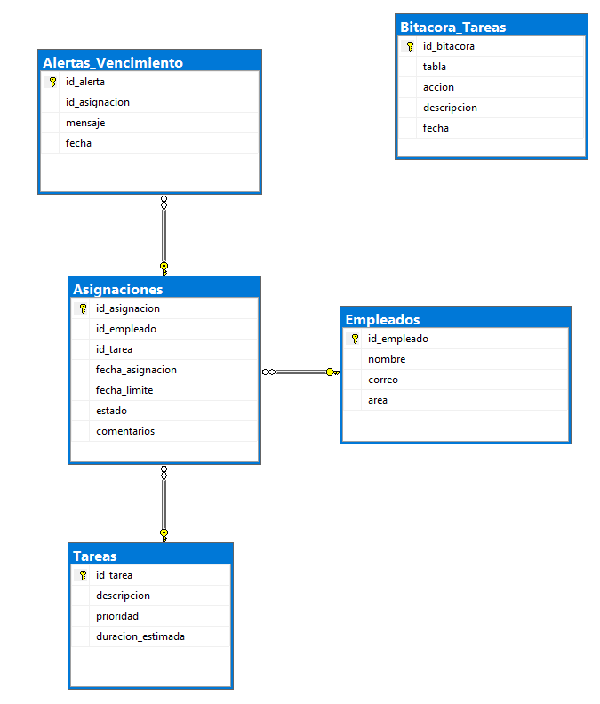
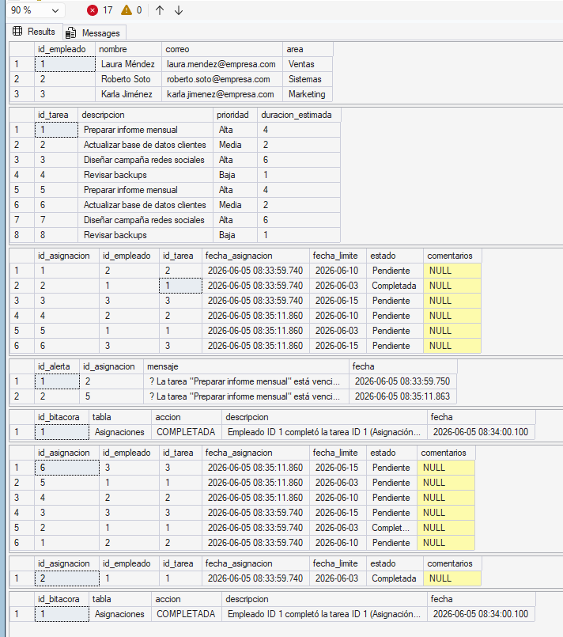

# PIA_BasesDeDatos_033

# Sistema de Tareas para Empleados

## Diagrama ER



---

## Descripción

Este proyecto implementa una base de datos para la gestión de tareas asignadas a empleados utilizando SQL Server.

El sistema permite:

* Registrar empleados y tareas.
* Asignar tareas a empleados.
* Completar tareas mediante procedimientos almacenados.
* Generar reportes de tareas.
* Registrar eventos en una bitácora.
* Generar alertas para tareas vencidas.

---

## Estructura de la Base de Datos

### Tablas

* **Empleados**: almacena la información de los empleados.
* **Tareas**: contiene las tareas disponibles para asignar.
* **Asignaciones**: relaciona empleados con tareas.
* **Bitacora_Tareas**: registra cambios importantes.
* **Alertas_Vencimiento**: almacena alertas de tareas vencidas.

### Procedimientos Almacenados

* `SP_AsignarTarea`

  * Asigna una tarea a un empleado.
  * Valida que existan el empleado y la tarea.

* `SP_CompletarTarea`

  * Marca una tarea como completada.

* `SP_ReporteTareas`

  * Genera un reporte de tareas entre dos fechas.

### Triggers

* `TR_Alerta_Vencimiento`

  * Genera una alerta cuando se registra una tarea vencida.

* `TR_Bitacora_Completadas`

  * Guarda en bitácora cuando una tarea cambia a estado completada.

---


## Pruebas

```sql
SELECT * FROM Empleados;
SELECT * FROM Tareas;
SELECT * FROM Asignaciones;
SELECT * FROM Alertas_Vencimiento;
SELECT * FROM Bitacora_Tareas;

EXEC SP_AsignarTarea 2, 4, DATEADD(DAY, 5, GETDATE()), 'Revisión semanal';

EXEC SP_CompletarTarea 2;
```

---

## Resultados de Ejecución



---

## Tecnologías Utilizadas

* SQL Server
* SQL Server Management Studio (SSMS)

---

## Autor

Emilio Martínez Veruzco
2086026
Grupo 033
